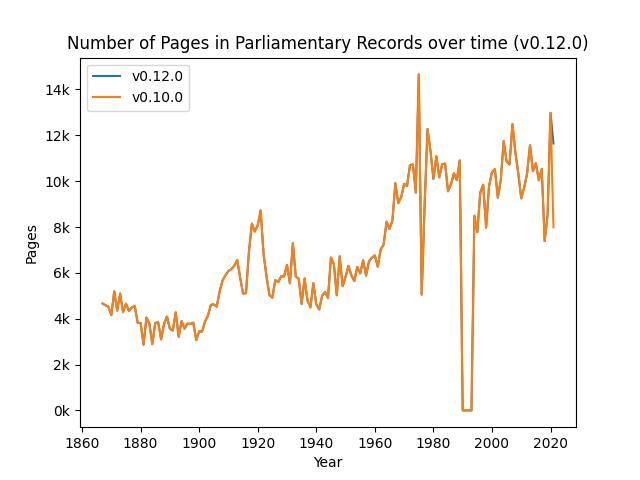
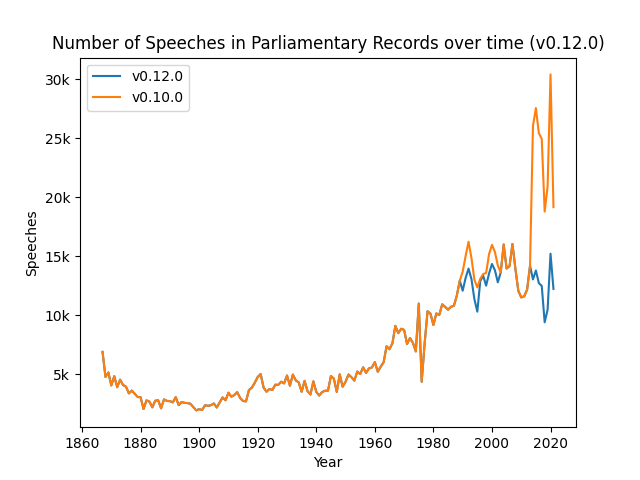
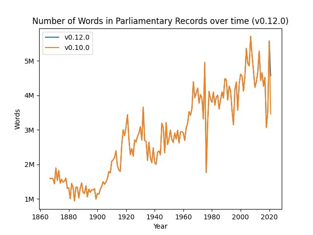
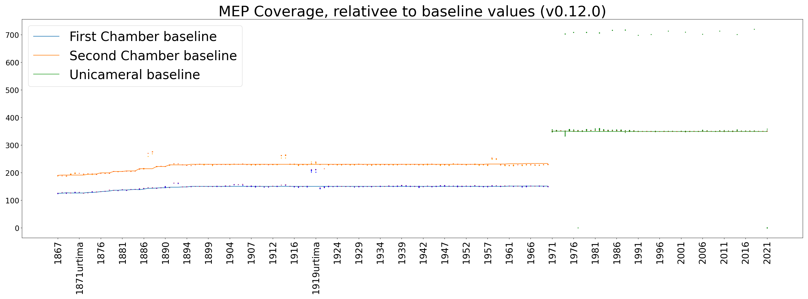
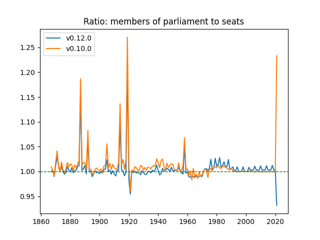

[](https://github.com/welfare-state-analytics/riksdagen-corpus/actions/workflows/push.yml)
[](https://github.com/welfare-state-analytics/riksdagen-corpus/actions/workflows/validate.yml)


# Swedish parliamentary proceedings --- 1867--today --- v0.10.0

_Westac Project_, 2020--2024 |
_Swerik Project_, 2023--2025


## The data set

The full data set consists of multiple parts:

- Parliamentary records (riksdagens protokoll) from 1867 until today in the [Parla-clarin](https://github.com/clarin-eric/parla-clarin) format
- Comprehensive list of members of parliament, ministers and governments during this period + associated metadata (mandate periods, party info, etc)
- [In progress] An annotated catalog of motions submitted to the parliament with linked metadata
- [Documentation](https://github.com/welfare-state-analytics/riksdagen-corpus/tree/main/docs/) of the corpus and the curation process
- [A Google Colab notebook](https://colab.research.google.com/drive/1C3e2gwi9z83ikXbYXNPfB6RF7spTgzxA?usp=sharing) that demonstrates how the dataset can be used with Python

## Basic use

A full dataset is available under [this download link](https://github.com/welfare-state-analytics/riksdagen-corpus/releases/latest/download/corpus.zip). It has the following structure

- Annual Parliamentary record (protocol) files in the ```corpus/protocols/``` directory
- Structured metadata on members of parliament, ministers, and governments in the ```corpus/metadata/``` directory

The workflow to use the data is demonstrated in [this Google Colab notebook](https://colab.research.google.com/drive/1C3e2gwi9z83ikXbYXNPfB6RF7spTgzxA?usp=sharing).

## Design choices of the project

The Riksdagen corpus is released as an iterative process, where the corpus is continuously curated and expanded. Semantic versioning is used for the whole corpus, following the established major-minor-patch practices as they apply to data. For each major and minor release, a battery of unit tests are run and a statistical sample is drawn, annotated and quantitatively evaluated to ensure integrety and quality of updated data. Errors are fixed as they are detected in order of priority. Moreover, the edit history is kept as a traceable git repository.

While the contents of the corpus will change due to curation and expansion, we aim to keep the deliverable API, the `corpus/` folder, as stable as possible. This means we avoid relocating files or folders, changing formats, changing columns in metadata files, or any other changes that might break downstream scripts. Conversely, files outside the `corpus/` folder are internal to the project. End users may find utility in them but we make no effort to keep them consistent.

The data in the corpus is delivered as TEI XML files to follow established practices. The metadata is delivered as CSV files, following a [normal form](https://en.wikipedia.org/wiki/Database_normalization) database structure while allowing for a legible git history. A more detailed description of the data and metadata structure and formats can be found in the README files in the `corpus/` folder.

## Descriptive statistics at a glance

Currently, we have an extensive set of Parliamentary Records (Riksdagens Protokoll) from 1867 until now. We are in the process of preparing Motions for inclusion in the corpus and other document types will follow.

|                                      |   v0.10.0  |
|--------------------------------------|------------|
|           Corpus size (GB)           |    5.58    |
|    Number of parliamentary records   |    17642   |
|   Total parliamentary record pages*  |   1041807  |
|  Total parliamentary record speeches |   1127027  |
|   Total parliamentary record words   |  441525242 |
|           Number of Motions          |      0     |
|          Total motion pages          |      0     |
|          Total motion words          |      0     |
|     Number of people with MP role    |    5975    |
|  Number of people with minister role |     535    |

\* Digital original parliamentary records for some years in the 1990s are not paginated and thus do not contribute to the page count.See also §_Number of Pages in Parliamentary Records_.

### Parliamentary Records over time

#### Number of Parliamentary Records


#### Number of Pages in Parliamentary Records



#### Number of Speeches in Parliamentary Records



Note: We are aware of an issue whereby speeches are over counted in the data's current form in the years after 2014 -- we're working on a fix. Until then, the following static graph is a better representation of the actual speeches in the Parliamentary Records for those years.


#### Number of Words in Parliamentary Records



### Members of Parliament over time



## Quality assessment

### Speech-to-speaker mapping

We check how many speakers in the parliamentary records our algorithms idenify in each release. 


### Correct number of MPs over time




## Participate in the curation process

If you find any errors, it is possible to submit corrections to them. This is documented in the [project wiki](https://github.com/welfare-state-analytics/riksdagen-corpus/wiki/Submit-corrections).


## Acknowledgement of support

- Westac funding: Vetenskapsrådet 2018-0606

- Swerik funding: Riksbankens Jubileumsfond IN22-0003


---
Last update: 2023-11-21, 12:27:58
